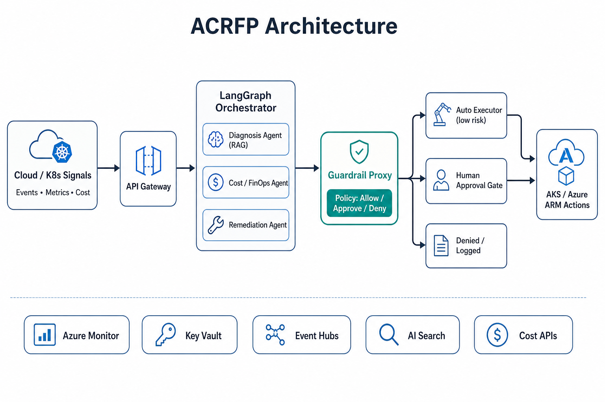
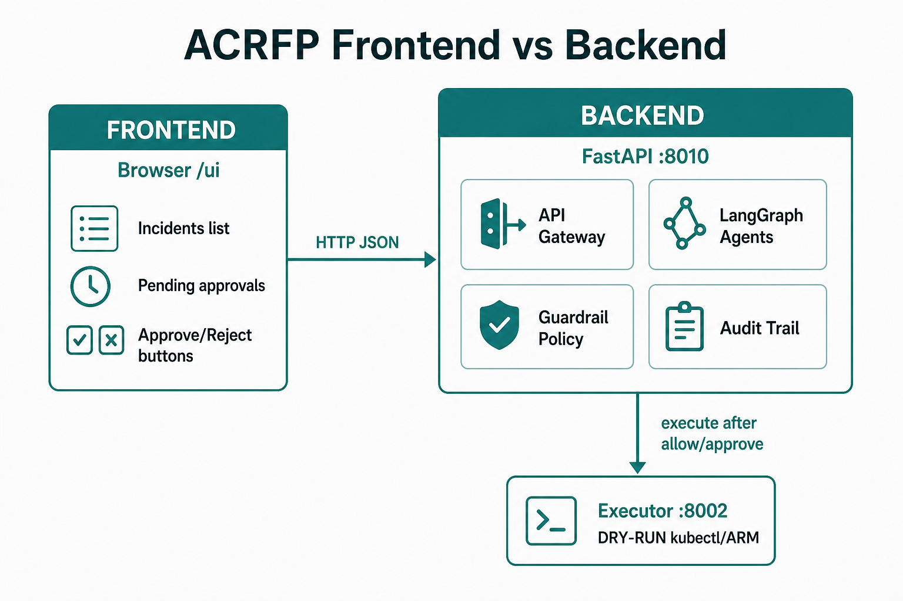

# Agentic Cloud Reliability & FinOps Platform (ACRFP)

Multi-agent system that watches Kubernetes/cloud signals, diagnoses **reliability** and **cost** issues, proposes typed fixes, and executes only what a **guardrail policy** allows — with a human approval gate for anything destructive.

Built for portfolio depth aimed at **EU public sector** and **Gulf (UAE/KSA) Azure/sovereign cloud** roles: agents that *manage infrastructure*, not just chat.

## Product vs platform

**ACRFP is the product** — one job: event in → diagnose → typed proposal → policy → dry-run or human approval.

It is called a *platform* in the title because that job is split into reusable services (API, guardrail, executor), not one chatbot script. **Azure** (AKS, Ingress, later Foundry) is the hosting / model platform. Do not describe this repo as “I built Azure AI Foundry.”

| Word | Meaning here |
|------|----------------|
| Product | The incident loop and `/ui` approval console |
| Platform (in the name) | Shared backend services other UIs could reuse |
| Azure / Foundry / AKS | Cloud platform this product runs on |

## Architecture

Full notes: [`docs/architecture.md`](docs/architecture.md)





```
Event (mock / Event Hubs)
        │
        ▼
   API Gateway ──► LangGraph Orchestrator
                      │
          ┌───────────┼───────────┐
          ▼           ▼           ▼
     Diagnosis     Cost/FinOps  Remediation
     (runbooks)    (cost APIs)  (structured proposals)
                      │
                      ▼
              Guardrail Proxy  ◄── authoritative risk policy
                      │
         ┌────────────┼────────────┐
         ▼            ▼            ▼
      ALLOW     REQUIRE_APPROVAL  DENY
         │            │
         ▼            ▼
     Executor     Human queue (/ui)
   (kubectl/ARM dry-run → live later)
```

**Non-negotiable separation (interview talking point):**
1. Agents never call `kubectl`/ARM directly.
2. Guardrail risk is computed from **action type + parameters**, not LLM self-rating.
3. Executor never runs without an allow/approval path.

## Frontend vs backend

There is no separate React app. FastAPI serves both.

| Layer | What it is | URL |
|-------|------------|-----|
| Frontend | Approval console (HTML + JS) | `GET /ui` |
| Backend API catalog | Swagger (same APIs, form UI) | `/docs` |
| Backend | FastAPI + LangGraph + agents + policy + executor | `/v1/*` |

`/ui` only **displays and asks**. It calls `/v1/approvals/pending`, `/v1/incidents`, `/v1/approvals/{id}/decide`, and `/v1/evals/run`. Scripts such as `scripts/ingest_samples.py` talk only to the backend.

On AKS, nginx Ingress is the HTTPS door in front of the API. It is not the frontend.

## How the backend calls (which file calls which)

The guardrail does **not** call the LLM. Agents call the model first. Policy runs after proposals exist.

```
POST /v1/incidents/ingest
  src/api/app.py  ingest()
    → src/orchestrator/graph.py  run_incident()
          triage_node()                 no AI  (event_type → route_plan)
          diagnosis_node()
            → src/agents/diagnosis.py  diagnose()
                  → src/agents/llm.py  chat_json()   ← only AI entry
          cost_node()
            → src/agents/cost.py  analyze_cost()
                  → llm.py  chat_json()
          remediate_node()
            → src/agents/remediation.py  propose_actions()
                  → llm.py  chat_json()  then ActionProposal objects
          guardrail_node()              no AI
            → HTTP src/guardrail/app.py  /v1/evaluate/batch
                  → src/guardrail/policy.py  decide()
            or in-process decide() if the guardrail service is down
          executor_node()               no AI  (only if ALLOW)
            → HTTP src/executor/app.py  /v1/execute
```

Shared types: `src/shared/models.py`. URLs and `LLM_PROVIDER`: `src/shared/config.py`.

Human approval (`POST /v1/approvals/{id}/decide`) does **not** re-run the graph. It sends the parked proposal to the executor after enough distinct approvers.

Read in this order for interviews: `models.py` → `graph.py` → `diagnosis.py` / `cost.py` / `remediation.py` → `llm.py` → `policy.py` → `executor/app.py` → `api/app.py`.

## LangChain, LangGraph, and evals

| Piece | Job in this repo |
|-------|------------------|
| LangChain | Thin model SDK in `llm.py` (`ChatOpenAI` / `ChatAnthropic`). Not used as an autonomous tool-loop. |
| LangGraph | Orchestrator in `graph.py`. Nodes and edges; routing is code, not a prompt. |
| `chat_json()` | Returns parsed JSON, or `None` (mock / missing key / error) so agents fall back to rules. |
| Evals | Tests for the **pipeline**, not prose quality. Golden incidents in `data/evals/golden_cases.yaml`. |

Evals call the same `run_incident()` as live ingest, then check specialists, `action_type`, guardrail verdict, and status. Score = checks passed / checks total. Same runner in `pytest`, `python scripts/run_evals.py`, and `POST /v1/evals/run`.

Run evals after changing agents, prompts, `policy.py`, or `LLM_PROVIDER`. Unit-test pure policy rules in `tests/test_guardrail_policy.py` — do not use an LLM judge for allow/deny.

## Repo layout

| Path | Role |
|------|------|
| `src/orchestrator/` | LangGraph state machine |
| `src/agents/` | Diagnosis, cost, remediation specialists |
| `src/guardrail/` | Policy engine + HTTP proxy |
| `src/executor/` | Dry-run / future live actions |
| `src/api/` | Ingest + incident + approval APIs |
| `data/runbooks/` | Local RAG corpus |
| `infra/k8s/` | AKS deploy manifests |
| `infra/helm/acrfp/` | Helm chart for AKS / GitOps deploys |
| `infra/argocd/` | Argo CD application manifest |
| `infra/terraform/` | Terraform root — calls `modules/rg` + `modules/aks` |
| `docs/architecture.md` | Architecture write-up + images |
| `docs/interview-evidence/` | Offline interviewer demo pack (HTML + screenshots) |
| `scripts/capture_interview_evidence.ps1` | Capture live screenshots/API dumps before stopping AKS |
| `scripts/terraform_apply.ps1` | Create Azure infra |
| `scripts/week3_aks_deploy.ps1` | Build image in ACR + kubectl apply |
| `tests/` | Guardrail, graph smoke, and golden-set evals |
| `data/evals/` | Golden incidents for the eval harness |
| `src/evals/` | Eval runner used by pytest, CLI, and `/v1/evals/run` |

## Quick start (local) — Command Prompt (`cmd.exe`)

Open **Command Prompt** (not PowerShell):

```bat
cd /d c:\Users\Administrator\OneDrive\Desktop\salman_genai\Multi_agents
python -m venv .venv
.venv\Scripts\activate.bat
pip install -r requirements.txt
copy .env.example .env
set PYTHONPATH=src
set LLM_PROVIDER=mock
```

### Option A — run API only (in-process guardrail fallback)

```bat
uvicorn api.app:app --reload --port 8000
```

Open a **second** Command Prompt:

```bat
cd /d c:\Users\Administrator\OneDrive\Desktop\salman_genai\Multi_agents
.venv\Scripts\activate.bat
set PYTHONPATH=src
python scripts\ingest_samples.py
```

### Option B — full local stack (Docker)

```bat
copy .env.example .env
docker compose up --build
```

Then ingest (with venv activated + `PYTHONPATH=src` as above):

```bat
python scripts\ingest_samples.py
```

### Useful endpoints

- `GET  /health`
- `POST /v1/incidents/ingest`
- `GET  /v1/incidents`
- `GET  /v1/approvals/pending`
- `POST /v1/approvals/{id}/decide` body: `{"decision":"approved","decided_by":"you"}`

Interactive docs: http://localhost:8000/docs

### Tests

```bat
set PYTHONPATH=src
set LLM_PROVIDER=mock
pytest -q
```

### Golden-set evals

Scores the **pipeline** (routing, typed proposals, guardrail verdicts) against fixtures in `data/evals/golden_cases.yaml`. Same runner as CI.

```bat
set PYTHONPATH=src
set LLM_PROVIDER=mock
python scripts\run_evals.py
```

Or with the API running: `POST /v1/evals/run` · `GET /v1/evals` · `/ui` → **Run evals**.

When you switch to Azure AI Foundry, re-run the suite and compare `score` + failed case ids against mock.

## LLM providers

Set in `.env`:

| `LLM_PROVIDER` | Notes |
|----------------|-------|
| `mock` (default) | Deterministic rule-based agents — no keys needed |
| `openai` | Needs `OPENAI_API_KEY` |
| `anthropic` | Needs `ANTHROPIC_API_KEY` |
| `azure_foundry` | Claude/OpenAI via Foundry **model endpoint** (`AZURE_FOUNDRY_*`) |

### Azure AI Foundry

Foundry is Microsoft’s hosted model catalog and chat endpoint (Azure billing, identity, region). In this repo it is only the phone line in `chat_json()`. It does not replace LangGraph or `policy.py`.

We use the **model endpoint** (`AZURE_FOUNDRY_ENDPOINT` + `/openai/v1`), not Foundry **Agent Service** (threads/runs). Agent Service is OpenAI-family only today; Claude stays on the endpoint + our graph — that is the skill to show.

Code is ready (`src/agents/llm.py`). The running app still defaults to `mock`. To switch: deploy a model in Foundry → set `LLM_PROVIDER=azure_foundry` and the three `AZURE_FOUNDRY_*` vars → restart API → re-run evals and compare `score` + failed case ids to mock. Guardrail still decides risk.

## Production path (Azure)

Week-by-week target:

1. **Now** — local graph + guardrail + dry-run executor (this repo)
2. **AKS via Terraform** (`infra/terraform`) — `.\scripts\terraform_apply.ps1`
3. Wire Event Hubs / Service Bus → ingest API
4. Azure AI Search over runbooks for diagnosis RAG
5. Cost Management + Consumption APIs for cost agent
6. Key Vault secrets + App Insights / GenAI tracing
7. Live executor with RBAC-scoped ServiceAccount (still behind guardrail)
8. GitHub Actions → AKS + demo video / architecture write-up

## AKS platform (Ingress + TLS + Argo CD)

One-shot install on AKS (installs Helm if missing, nginx-ingress, cert-manager, Argo CD):

```powershell
powershell -ExecutionPolicy Bypass -File .\scripts\install_aks_platform.ps1 -LetsEncryptEmail you@yourdomain.com
```

| Component | Namespace | Purpose |
|-----------|-----------|---------|
| nginx-ingress | `ingress-nginx` | Public HTTP/HTTPS entry (LoadBalancer IP) |
| cert-manager | `cert-manager` | Let's Encrypt TLS certificates |
| Argo CD | `argocd` | GitOps deploy from `infra/helm/acrfp` |

**DNS (required for TLS):** Point `api.acrfp.site` A-record → nginx LoadBalancer IP (`kubectl get svc -n ingress-nginx`).

Domain: **acrfp.site** (GoDaddy). See `commands.md` Week 3.5 for GoDaddy steps.

**Deploy app with HTTPS:**

```powershell
kubectl apply -f infra/k8s/ingress/api-ingress.yaml
```

Or Helm (fresh cluster only):

```powershell
helm upgrade --install acrfp infra/helm/acrfp -f infra/helm/acrfp/values-ingress.yaml
```

`acrfp-api` uses `ClusterIP`; only nginx-ingress gets a public LoadBalancer. Guardrail and executor stay internal.

### Ingress traffic path

```
Browser / curl
  → DNS  api.acrfp.site  (GoDaddy A record)
  → Azure Load Balancer on nginx-ingress
  → nginx Ingress Controller  (TLS via cert-manager / Let's Encrypt)
  → Service acrfp-api ClusterIP :80 → pod :8000
  → API then calls http://acrfp-guardrail:8001 and http://acrfp-executor:8002
     (cluster DNS only — no Ingress)
```

| Component | Namespace | Public? | Role |
|-----------|-----------|---------|------|
| nginx-ingress | `ingress-nginx` | Yes (LoadBalancer) | Only front door |
| cert-manager | `cert-manager` | No | Issues `acrfp-api-tls` |
| acrfp-api | `default` | Via Ingress host | Product API + `/ui` |
| acrfp-guardrail | `default` | No | Policy |
| acrfp-executor | `default` | No | Dry-run |
| Argo CD | `argocd` | Optional LB | GitOps, not the product |

Laptop demos do not need Ingress (`localhost:8000`). Ingress is the AKS HTTPS edge only.

## Helm and Argo CD

- Helm chart: `infra/helm/acrfp` (+ `values-ingress.yaml` for TLS)
- ClusterIssuers: `infra/platform/cluster-issuer.yaml`
- Argo CD app: `infra/argocd/acrfp-application.yaml` (replace `repoURL` with your Git repo)

## What you must be able to explain

Open and walk through line-by-line:

- `src/guardrail/policy.py` — risk classification + allow/approve/deny
- `src/orchestrator/graph.py` — triage → specialists → guardrail → executor

Do not treat those two files as generated magic. Interviewers will probe them.

## What is done vs pending

### Done (Week 1 + Phase A + Week 3 infra)
- Local multi-agent platform (LangGraph + 3 specialists + executor dry-run)
- Guardrail policy engine + HTTP proxy + `/ui` approval console
- Sample events, tests, Docker Compose, K8s manifests, CI
- Audit trail, YAML policy packs, dual approval, region lock, webhook notify
- **Terraform modules** for RG + AKS (`centralindia` cluster live)
- Architecture doc + images (`docs/architecture.md`)
- Helm chart, Ingress/TLS manifests, platform install script (`install_aks_platform.ps1`)

### Pending (next)
- **Deploy app to AKS** (`.\scripts\week3_aks_deploy.ps1`) then ingress or port-forward test
- **DNS A-record** for your domain → nginx LoadBalancer IP
- Later: Azure Foundry, Event Hubs, Cost APIs, AI Search, live executor
- Demo video + CV bullets

## New enterprise endpoints

- `GET /v1/audit`
- `GET /v1/incidents/{id}/audit`
- `GET /v1/audit/export?format=json|csv`
- `GET /v1/evals/cases` · `POST /v1/evals/run` · `GET /v1/evals`
- Approvals: HIGH risk needs 2 different `decided_by` values

Switch policy pack:

```bat
set POLICY_PACK=prod
```

## License

Portfolio project — use/modify for your job search.
