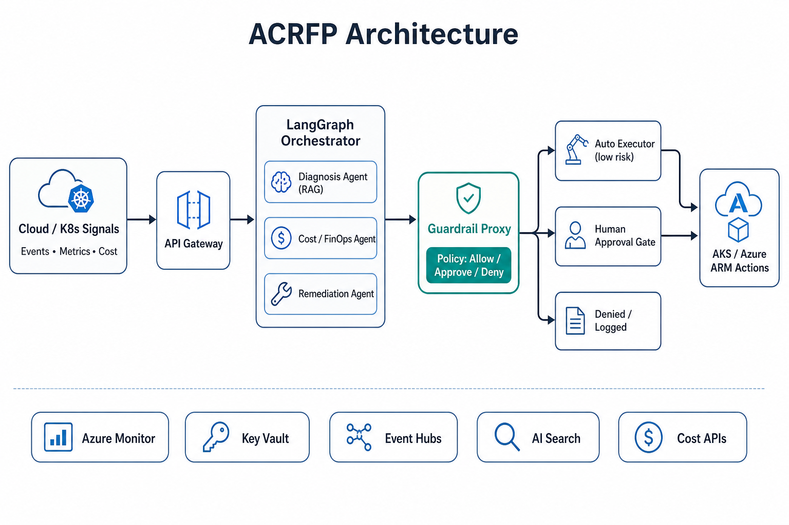
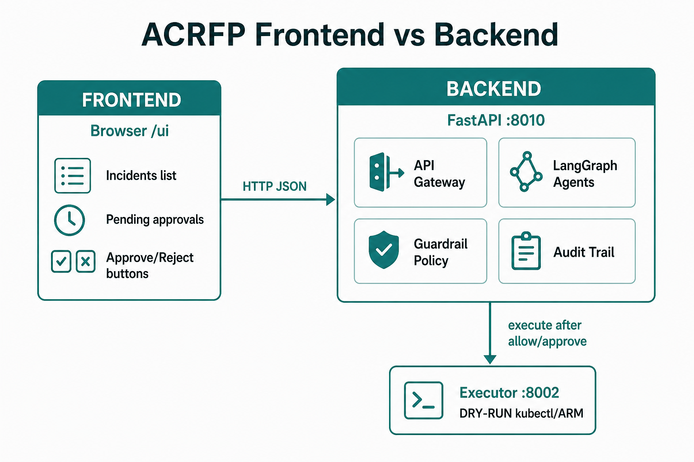

# Agentic Cloud Reliability & FinOps Platform (ACRFP)

Multi-agent system that watches Kubernetes/cloud signals, diagnoses **reliability** and **cost** issues, proposes typed fixes, and executes only what a **guardrail policy** allows — with a human approval gate for anything destructive.

Built for portfolio depth aimed at **EU public sector** and **Gulf (UAE/KSA) Azure/sovereign cloud** roles: agents that *manage infrastructure*, not just chat.

## Product vs platform

**ACRFP is the product** — one job: event in → diagnose → typed proposal → policy → dry-run or human approval.

It is called a *platform* in the title because that job is split into reusable services (API, guardrail, executor), not one chatbot script. **Azure** (AKS, Ingress, later Foundry) is the hosting / model platform. Do not describe this repo as “I built Azure AI Foundry.”

| Word | Meaning here |
|------|----------------|
| Product | The incident loop and `/ui` approval console |
| Platform (in the name) | Shared backend services other UIs could reuse |
| Azure / Foundry / AKS | Cloud platform this product runs on |

## Architecture

Full notes: [`docs/architecture.md`](docs/architecture.md)





```
Event (mock / Event Hubs)
        │
        ▼
   API Gateway ──► LangGraph Orchestrator
                      │
          ┌───────────┼───────────┐
          ▼           ▼           ▼
     Diagnosis     Cost/FinOps  Remediation
     (runbooks)    (cost APIs)  (structured proposals)
                      │
                      ▼
              Guardrail Proxy  ◄── authoritative risk policy
                      │
         ┌────────────┼────────────┐
         ▼            ▼            ▼
      ALLOW     REQUIRE_APPROVAL  DENY
         │            │
         ▼            ▼
     Executor     Human queue (/ui)
   (kubectl/ARM dry-run → live later)
```

**Non-negotiable separation (interview talking point):**
1. Agents never call `kubectl`/ARM directly.
2. Guardrail risk is computed from **action type + parameters**, not LLM self-rating.
3. Executor never runs without an allow/approval path.

## Frontend vs backend

There is no separate React app. FastAPI serves both.

| Layer | What it is | URL |
|-------|------------|-----|
| Frontend | Approval console (HTML + JS) | `GET /ui` |
| Backend API catalog | Swagger (same APIs, form UI) | `/docs` |
| Backend | FastAPI + LangGraph + agents + policy + executor | `/v1/*` |

`/ui` only **displays and asks**. It calls `/v1/summary`, `/v1/approvals/pending`, `/v1/incidents` (optional `?status=`), `/v1/approvals/{id}/decide`, and `/v1/evals/run`. Scripts such as `scripts/ingest_samples.py` talk only to the backend.

On AKS, nginx Ingress is the HTTPS door in front of the API. It is not the frontend.

## How the backend calls (which file calls which)

The guardrail does **not** call the LLM. Agents call the model first. Policy runs after proposals exist.

```
POST /v1/incidents/ingest
  src/api/app.py  ingest()
    → src/orchestrator/graph.py  run_incident()
          triage_node()                 no AI  (event_type → route_plan)
          diagnosis_node()
            → src/agents/diagnosis.py  diagnose()
                  → src/agents/llm.py  chat_json()   ← only AI entry
          cost_node()
            → src/agents/cost.py  analyze_cost()
                  → llm.py  chat_json()
          remediate_node()
            → src/agents/remediation.py  propose_actions()
                  → llm.py  chat_json()  then ActionProposal objects
          guardrail_node()              no AI
            → HTTP src/guardrail/app.py  /v1/evaluate/batch
                  → src/guardrail/policy.py  decide()
            or in-process decide() if the guardrail service is down
          executor_node()               no AI  (only if ALLOW)
            → HTTP src/executor/app.py  /v1/execute
```

Shared types: `src/shared/models.py`. URLs and `LLM_PROVIDER`: `src/shared/config.py`.

Human approval (`POST /v1/approvals/{id}/decide`) does **not** re-run the graph. It sends the parked proposal to the executor after enough distinct approvers.

Read in this order for interviews: `models.py` → `graph.py` → `diagnosis.py` / `cost.py` / `remediation.py` → `llm.py` → `policy.py` → `executor/app.py` → `api/app.py`.

Shareable walkthrough (upload to SharePoint / send to interviewers): [`docs/sharepoint/ACRFP-end-to-end-call-flow.md`](docs/sharepoint/ACRFP-end-to-end-call-flow.md). Same story: [`docs/architecture.md`](docs/architecture.md), [`docs/interview-evidence/`](docs/interview-evidence/).

### From-scratch: one ingest (who calls `llm.py`)

Example input: `payments-api` restart storm (`event_type: reliability`). You POST `/v1/incidents/ingest`. You never call `llm.py` yourself.

1. `src/api/app.py` `ingest()` → `run_incident(event_dict)` — no model.
2. `src/orchestrator/graph.py` `run_incident()` → `graph.invoke()` — LangGraph picks the next **function**.
3. `triage_node()` — if/else on `event_type`. This event → `["diagnosis"]`. No `llm.py`.
4. `diagnosis_node()` → `src/agents/diagnosis.py` `diagnose()` → **`src/agents/llm.py` `chat_json()`** (1st model call, or `None` if `mock`) → `DiagnosisResult`.
5. `remediate_node()` → `src/agents/remediation.py` `propose_actions()` → **`llm.py` `chat_json()`** (2nd call, or rules) → `ActionProposal` list. **Model is done.**
6. `guardrail_node()` → `src/guardrail/app.py` or in-process `src/guardrail/policy.py` `decide()` — no `llm.py`.
7. If ALLOW: `executor_node()` → `src/executor/app.py` — dry-run kubectl string. No `llm.py`.
8. Back to `ingest()` → `_case_from_graph()` + `src/shared/audit.py` → JSON to you.

`llm.py` is imported only by `diagnosis.py`, `cost.py`, and `remediation.py`. Cost is skipped unless `event_type` is `cost` or `mixed`. `/ui` approve does **not** call `llm.py`.

## Technical terms (LangChain, LangGraph, Langfuse, models)

These names are easy to mix up. In this repo they have different jobs.

| Term | What it is | Used here? |
|------|------------|------------|
| **LLM / model** | The text model (GPT, Claude, or a mock). Predicts the next tokens; it does not run kubectl. | Yes — only via `src/agents/llm.py` |
| **LangChain** | Python SDK to call vendors with one interface (`invoke` messages, parse JSON). Also has chains, tools, and “agents,” which we do **not** use. | Yes — `ChatOpenAI` / `ChatAnthropic` only |
| **LangGraph** | State machine: nodes (functions), edges (what runs next), shared `GraphState`. Built by the LangChain team; it is not “LangChain agents.” | Yes — `src/orchestrator/graph.py` |
| **Langfuse** | Observability: traces each prompt, tokens, latency, and cost. Like LangSmith, but self-hostable / EU-friendly. | **Not wired yet.** Audit log covers incidents and verdicts, not prompt traces. Planned with App Insights. |
| **Prompt** | System role (job + JSON schema) + user role (the incident). | Yes — inside each specialist |
| **Temperature** | Randomness. We use `0` so the same incident tends to produce the same JSON. | Yes |
| **Structured output** | Model must return fields a program can validate (`ActionProposal`). | Yes — Pydantic |
| **RAG** | Fetch docs, then generate. Diagnosis keyword-matches `data/runbooks/*.md`. | Yes — local only; Azure AI Search later |
| **Evals** | Tests for the pipeline (routing, action type, verdict), not writing quality. | Yes — golden set |
| **Guardrail** | Policy outside the model. Not Langfuse and not the model’s `risk_hint`. | Yes — `policy.py` |

**How they fit:** LangChain talks to the model. LangGraph decides the next step. Langfuse (later) would record what the model said. Evals decide if the system is still correct. Guardrail decides if an action may run.

```
LangChain  →  “call GPT/Claude/Foundry, give me JSON”
LangGraph  →  triage → diagnosis/cost → remediate → guardrail → executor
Langfuse   →  (planned) trace each LLM call
Evals      →  replay golden incidents, score the graph + policy
```

### Models (`LLM_PROVIDER`)

| Value | Model / backend | When |
|-------|-----------------|------|
| `mock` (default) | No network. Agents use rules. | CI, demos, no keys |
| `openai` | `gpt-4o-mini` via LangChain `ChatOpenAI` | Public OpenAI key |
| `anthropic` | `claude-sonnet-4-5` via `ChatAnthropic` | Anthropic key |
| `azure_foundry` | Deployment name (default `claude-sonnet-4-5`) on Foundry `/openai/v1` | Azure-hosted model |

`chat_json()` returns parsed JSON, or `None` if mock / missing key / error. Specialists then use rule fallbacks. Switching providers does not change LangGraph or `policy.py`.

**Interview line:** we did not use a LangChain tool-calling agent with kubectl. We did not use Foundry Agent Service as the orchestrator. LangGraph is the playbook; the model only fills typed JSON.

### Evals (how we score the stack)

Evals call the same `run_incident()` as live ingest, then check specialists, `action_type`, guardrail verdict, and status. Score = checks passed / checks total. Same runner in `pytest`, `python scripts/run_evals.py`, and `POST /v1/evals/run`.

Run evals after changing agents, prompts, `policy.py`, or `LLM_PROVIDER`. Unit-test pure policy rules in `tests/test_guardrail_policy.py` — do not use an LLM judge for allow/deny.

## Repo layout

| Path | Role |
|------|------|
| `src/orchestrator/` | LangGraph state machine |
| `src/agents/` | Diagnosis, cost, remediation specialists |
| `src/guardrail/` | Policy engine + HTTP proxy |
| `src/executor/` | Dry-run / future live actions |
| `src/api/` | Ingest + incident + approval APIs |
| `data/runbooks/` | Local RAG corpus |
| `infra/k8s/` | AKS deploy manifests |
| `infra/helm/acrfp/` | Helm chart for AKS / GitOps deploys |
| `infra/argocd/` | Argo CD application manifest |
| `infra/terraform/` | Terraform root — calls `modules/rg` + `modules/aks` |
| `docs/architecture.md` | Architecture write-up + images |
| `docs/sharepoint/` | SharePoint-ready end-to-end call flow |
| `docs/interview-evidence/` | Offline interviewer demo pack (HTML + screenshots) |
| `scripts/capture_interview_evidence.ps1` | Capture live screenshots/API dumps before stopping AKS |
| `scripts/terraform_apply.ps1` | Create Azure infra |
| `scripts/week3_aks_deploy.ps1` | Build image in ACR + kubectl apply |
| `tests/` | Guardrail, graph smoke, and golden-set evals |
| `data/evals/` | Golden incidents for the eval harness |
| `src/evals/` | Eval runner used by pytest, CLI, and `/v1/evals/run` |

## Quick start (local) — Command Prompt (`cmd.exe`)

Open **Command Prompt** (not PowerShell):

```bat
cd /d c:\Users\Administrator\OneDrive\Desktop\salman_genai\Multi_agents
python -m venv .venv
.venv\Scripts\activate.bat
pip install -r requirements.txt
copy .env.example .env
set PYTHONPATH=src
set LLM_PROVIDER=mock
```

### Option A — run API only (in-process guardrail fallback)

```bat
uvicorn api.app:app --reload --port 8000
```

Open a **second** Command Prompt:

```bat
cd /d c:\Users\Administrator\OneDrive\Desktop\salman_genai\Multi_agents
.venv\Scripts\activate.bat
set PYTHONPATH=src
python scripts\ingest_samples.py
```

### Option B — full local stack (Docker)

```bat
copy .env.example .env
docker compose up --build
```

Then ingest (with venv activated + `PYTHONPATH=src` as above):

```bat
python scripts\ingest_samples.py
```

### Useful endpoints

- `GET  /health`
- `POST /v1/incidents/ingest`
- `GET  /v1/incidents` · query `status=` and `event_type=` (comma-separated)
- `GET  /v1/summary` · counts by status/type, pending approvals, last eval score
- `GET  /v1/approvals/pending`
- `POST /v1/approvals/{id}/decide` body: `{"decision":"approved","decided_by":"you"}`

Interactive docs: http://localhost:8000/docs

### Ops summary and filters (`feature/ops-summary`)

The approval console is a live dashboard, not only an approve/reject list.

| Piece | What it does |
|-------|----------------|
| `GET /v1/summary` | Counts incidents by `status` and `event_type`, pending approval total, `llm_provider`, `policy_pack`, last eval `score` |
| `GET /v1/incidents?status=` | Filter: `resolved`, `awaiting_approval`, `blocked`, `remediating` (comma-separated) |
| `GET /v1/incidents?event_type=` | Filter: `reliability`, `cost`, `mixed` |
| `/ui` cards + dropdown | Renders summary counts; the status dropdown calls the filter query |

Does **not** re-run LangGraph. It reads the in-memory `CASES` / `APPROVALS` stores. Tests: `tests/test_ops_summary.py`.

### Tests

```bat
set PYTHONPATH=src
set LLM_PROVIDER=mock
pytest -q
```

### Golden-set evals

Scores the **pipeline** (routing, typed proposals, guardrail verdicts) against fixtures in `data/evals/golden_cases.yaml`. Same runner as CI.

```bat
set PYTHONPATH=src
set LLM_PROVIDER=mock
python scripts\run_evals.py
```

Or with the API running: `POST /v1/evals/run` · `GET /v1/evals` · `/ui` → **Run evals**.

When you switch to Azure AI Foundry, re-run the suite and compare `score` + failed case ids against mock.

## LLM providers

Set in `.env`:

| `LLM_PROVIDER` | Notes |
|----------------|-------|
| `mock` (default) | Deterministic rule-based agents — no keys needed |
| `openai` | Needs `OPENAI_API_KEY` |
| `anthropic` | Needs `ANTHROPIC_API_KEY` |
| `azure_foundry` | Claude/OpenAI via Foundry **model endpoint** (`AZURE_FOUNDRY_*`) |

### Azure AI Foundry

Foundry is Microsoft’s hosted model catalog and chat endpoint (Azure billing, identity, region). In this repo it is only the phone line in `chat_json()`. It does not replace LangGraph or `policy.py`.

We use the **model endpoint** (`AZURE_FOUNDRY_ENDPOINT` + `/openai/v1`), not Foundry **Agent Service** (threads/runs). Agent Service is OpenAI-family only today; Claude stays on the endpoint + our graph — that is the skill to show.

Code is ready (`src/agents/llm.py`). The running app still defaults to `mock`. Guardrail still decides risk after the model returns JSON.

#### What “deploy to Foundry” means here

You do **not** upload ACRFP into Foundry. You deploy a **model** in Azure AI Foundry, then point this API at that model.

```
Azure Portal / Foundry
  → create project in a region (e.g. westeurope / uaenorth)
  → deploy Claude or GPT from the catalog
  → copy endpoint + key + deployment name
        ↓
ACRFP .env / AKS secrets
  LLM_PROVIDER=azure_foundry
  AZURE_FOUNDRY_*
        ↓
src/agents/llm.py  chat_json()
  ChatOpenAI → {endpoint}/openai/v1
        ↓
diagnosis / cost / remediation get JSON
        ↓
guardrail.policy.decide()   (unchanged)
```

#### Step-by-step (Azure portal)

1. Sign in to [Azure AI Foundry](https://ai.azure.com) (or create an Azure AI / Foundry resource in the portal).
2. Pick a **region** that matches your sovereignty story (`westeurope`, `northeurope`, `uaenorth`, … — not a random US endpoint for EU/Gulf demos).
3. Open the **model catalog** → choose a chat model (this repo defaults to deployment name `claude-sonnet-4-5`; GPT-family also works via the same OpenAI-compatible URL).
4. Click **Deploy** → note:
   - **Endpoint** (base URL of the resource)
   - **API key** (or plan Key Vault + managed identity later)
   - **Deployment name** (exact string your app will send as `model=`)
5. Do **not** create a Foundry Agent / thread for ACRFP. Keep orchestration in LangGraph.

#### Wire local (Command Prompt)

```bat
cd /d c:\Users\Administrator\OneDrive\Desktop\salman_genai\Multi_agents
copy .env.example .env
```

Edit `.env` (base URL only — do **not** put `/openai/v1` in the endpoint; `llm.py` appends it):

```bat
LLM_PROVIDER=azure_foundry
AZURE_FOUNDRY_ENDPOINT=https://YOUR-RESOURCE.cognitiveservices.azure.com
AZURE_FOUNDRY_API_KEY=YOUR_KEY
AZURE_FOUNDRY_DEPLOYMENT=claude-sonnet-4-5
```

Portal endpoints may also look like `*.services.ai.azure.com`. Use whatever Foundry shows as the resource endpoint; keep it without a trailing `/openai/v1`.

Then:

```bat
set PYTHONPATH=src
uvicorn api.app:app --reload --port 8000
```

In another window:

```bat
set PYTHONPATH=src
python scripts\ingest_samples.py
python scripts\run_evals.py
```

Compare eval `score` and failed case ids to a prior `mock` run. If Foundry is unreachable or the key is empty, `chat_json()` returns `None` and agents fall back to rules (same as mock).

#### Wire on AKS (when the app is deployed)

Set the same four values as env on the **api** Deployment (and later Key Vault), restart pods, then ingest + run evals against `https://api.acrfp.site`. Guardrail and executor env do **not** need Foundry keys — only the API process that runs the agents.

Example (patch after deploy; prefer Secrets in real use):

```powershell
kubectl set env deployment/acrfp-api `
  LLM_PROVIDER=azure_foundry `
  AZURE_FOUNDRY_ENDPOINT=https://YOUR-RESOURCE.cognitiveservices.azure.com `
  AZURE_FOUNDRY_API_KEY=YOUR_KEY `
  AZURE_FOUNDRY_DEPLOYMENT=claude-sonnet-4-5
```

#### Checklist after switch

| Check | Pass looks like |
|-------|-----------------|
| Ingest still returns a case | `/v1/incidents` has diagnosis / proposals |
| Proposals still typed | Valid `ActionProposal` / `action_type` |
| Guardrail unchanged | Same allow / approve / deny rules |
| Evals | `POST /v1/evals/run` or `python scripts\run_evals.py` — investigate any new failures |
| No key in Git | Only `.env` / K8s Secret / Key Vault |

#### Interview lines

- “Foundry hosts the model; ACRFP hosts the control plane.”
- “We call the Foundry **model endpoint**, not Agent Service, so Claude + our graph stay under our policy.”
- “Switching mock → Foundry is an env change in `llm.py`, not a rewrite of triage or `policy.py`.”


## Production path (Azure)

Where we are vs next:

1. **Done** — local graph + guardrail + dry-run executor; golden evals; ops summary
2. **Done** — AKS via Terraform + app deploy + Ingress/TLS for `api.acrfp.site` (cluster may be **stopped** for cost; restart with `az aks start`)
3. **Next** — wire **Azure AI Foundry** (`LLM_PROVIDER=azure_foundry`; code ready in `llm.py`)
4. Wire Event Hubs / Service Bus → ingest API
5. Azure AI Search over runbooks for diagnosis RAG
6. Cost Management + Consumption APIs for cost agent
7. Key Vault secrets + App Insights / GenAI tracing (Langfuse optional)
8. Live executor with RBAC-scoped ServiceAccount (still behind guardrail)
9. Demo video / CV bullets

Foundry wiring steps: see *Azure AI Foundry* above (deploy the **model**, point the API — do not upload the app into Foundry).

## AKS platform (Ingress + TLS + Argo CD)

One-shot install on AKS (installs Helm if missing, nginx-ingress, cert-manager, Argo CD):

```powershell
powershell -ExecutionPolicy Bypass -File .\scripts\install_aks_platform.ps1 -LetsEncryptEmail you@yourdomain.com
```

| Component | Namespace | Purpose |
|-----------|-----------|---------|
| nginx-ingress | `ingress-nginx` | Public HTTP/HTTPS entry (LoadBalancer IP) |
| cert-manager | `cert-manager` | Let's Encrypt TLS certificates |
| Argo CD | `argocd` | GitOps deploy from `infra/helm/acrfp` |

**DNS (required for TLS):** Point `api.acrfp.site` A-record → nginx LoadBalancer IP (`kubectl get svc -n ingress-nginx`).

Domain: **acrfp.site** (GoDaddy). See `commands.md` Week 3.5 for GoDaddy steps.

**Deploy app with HTTPS:**

```powershell
kubectl apply -f infra/k8s/ingress/api-ingress.yaml
```

Or Helm (fresh cluster only):

```powershell
helm upgrade --install acrfp infra/helm/acrfp -f infra/helm/acrfp/values-ingress.yaml
```

`acrfp-api` uses `ClusterIP`; only nginx-ingress gets a public LoadBalancer. Guardrail and executor stay internal.

### Ingress traffic path

```
Browser / curl
  → DNS  api.acrfp.site  (GoDaddy A record)
  → Azure Load Balancer on nginx-ingress
  → nginx Ingress Controller  (TLS via cert-manager / Let's Encrypt)
  → Service acrfp-api ClusterIP :80 → pod :8000
  → API then calls http://acrfp-guardrail:8001 and http://acrfp-executor:8002
     (cluster DNS only — no Ingress)
```

| Component | Namespace | Public? | Role |
|-----------|-----------|---------|------|
| nginx-ingress | `ingress-nginx` | Yes (LoadBalancer) | Only front door |
| cert-manager | `cert-manager` | No | Issues `acrfp-api-tls` |
| acrfp-api | `default` | Via Ingress host | Product API + `/ui` |
| acrfp-guardrail | `default` | No | Policy |
| acrfp-executor | `default` | No | Dry-run |
| Argo CD | `argocd` | Optional LB | GitOps, not the product |

Laptop demos do not need Ingress (`localhost:8000`). Ingress is the AKS HTTPS edge only.

## Helm and Argo CD

- Helm chart: `infra/helm/acrfp` (+ `values-ingress.yaml` for TLS)
- ClusterIssuers: `infra/platform/cluster-issuer.yaml`
- Argo CD app: `infra/argocd/acrfp-application.yaml` (replace `repoURL` with your Git repo)

## How to scale this platform

Scale **services**, **state**, and **models** separately. Do not scale by giving the LLM `kubectl`.

### What already scales (or is ready to)

| Piece | Today | Scale path |
|-------|-------|------------|
| API / guardrail / executor | Separate processes; guardrail can run 2+ replicas | Horizontal pods behind Ingress; keep guardrail and executor **ClusterIP only** |
| Ingest | Sync `POST /v1/incidents/ingest` | Put **Event Hubs / Service Bus** in front; workers pull and call `run_incident()` |
| Triage | Deterministic `if/else` on `event_type` | Stays cheap at high volume — never replace with an LLM router |
| Policy | YAML packs + `policy.py` | Version packs in Git; run many API replicas against the same pack |
| Models | `mock` / OpenAI / Anthropic / Foundry via `llm.py` | Raise Foundry quota / PTU; keep `temperature=0` and structured JSON |
| Runbooks | Local keyword match | Move to **Azure AI Search** when the corpus grows |
| Evals | Golden set in CI | Re-run after every prompt or provider change before promoting |

### Required before multi-replica API

Cases and approvals are **in-memory** today. Before scaling the API past one pod:

1. Move `CASES` / `APPROVALS` to **Cosmos DB or Postgres**.
2. Keep audit append-only (JSONL / Log Analytics / Blob).
3. Idempotency on `event_id` so the same alert does not remediate twice.
4. Optional: parallel diagnosis + cost for `mixed` events (today sequential).

### What not to do when scaling

- Do not auto-scale live `delete_*` by adding executor replicas alone.
- Do not put Foundry Agent Service (or a LangChain tool-loop) in charge of cluster writes.
- Do not expose guardrail or executor on a public LoadBalancer.
- Do not stuff full cluster dumps into prompts — bound tokens; retrieve a few runbooks only.

### Multi-cluster sketch

```
Event Hubs (per subscription / region)
        → API workers (stateless) + shared DB
              → Guardrail service (shared policy packs)
                    → Executor per cluster (scoped ServiceAccount / RBAC)
                          → Foundry in-region (westeurope / uaenorth / …)
```

Control plane (API, graph, policy, audit) scales with queues + DB.  
Data plane (executor) scales per cluster with **least-privilege RBAC**, not one god credential.

## Governance — how this project follows it

Governance here means: **who may do what**, **who approved**, and **can you prove it**. It is policy-as-code + human gates + audit — not a PDF.

### Rules already enforced in code

| Control | Where | What it does |
|---------|-------|--------------|
| Separation of duties | Graph → agents → guardrail → executor | Agents **propose** only; they never call `kubectl` / ARM |
| Authoritative risk | `src/guardrail/policy.py` | Risk from **action type + parameters + namespace + region**; agent `risk_hint` can only **raise** risk |
| Deny-unknown / deny-critical | Policy packs | Unknown actions and CRITICAL (`delete_namespace`, `delete_resource_group`, `modify_iam`) are denied |
| Human-in-the-loop | `/ui` + `/v1/approvals` | MEDIUM → 1 approver; HIGH → **2 distinct** `decided_by` (same person cannot count twice) |
| Sovereign region lock | `allowed_regions` in YAML | e.g. deny `us-east-1`; prod pack targets EU / UAE / Qatar |
| Protected namespaces | YAML packs | `kube-system`, `prod`, and (in `prod`) `payments` / `checkout` escalate to HIGH |
| Scale limits | YAML `limits` | Cap replicas and scale delta so auto-remediation cannot explode capacity |
| Reconstructability | `src/shared/audit.py` | Ingest, verdict (`policy_ids`), approval, execution — export JSON/CSV |
| Change control | CI + golden evals | `pytest` with `LLM_PROVIDER=mock`; evals fail if routing / verdicts drift |
| Policy packs | `data/policies/local.yaml` vs `prod.yaml` | Switch with `POLICY_PACK=prod` without rewriting agents |
| GitOps path | Helm + Argo CD | Desired deploy state lives in Git |

### How you follow governance day to day

1. **Never** let a specialist call the executor. New remediations must be an `ActionType` + `ActionProposal`, then pass `decide()`.
2. Change safety rules in **YAML packs** (or `policy.py`), review in Git, re-run `pytest` + `python scripts/run_evals.py`.
3. Use **`POLICY_PACK=prod`** for regulated demos (stricter scale caps, no `local` region, more protected namespaces).
4. For HIGH risk: collect **two different** approvers in `/ui` before execute.
5. After every incident: show `/v1/audit` (or export) — who proposed, which `POL-*` ids fired, who approved, dry-run command.
6. After prompt or Foundry changes: re-run **golden evals** and compare `score` + failed case ids to mock.
7. Keep Foundry / keys out of Git; later use Key Vault + managed identity.

### Honest gaps (say this in interviews)

Not wired yet: Azure AD on `/ui`, ServiceNow ticket link, Key Vault, live executor RBAC, Langfuse prompt traces. Identity on approvals is still a string (`alice` / `bob`). Those are the next governance layer — the **architectural** controls (separation, policy, dual approval, region lock, audit) are what this repo already demonstrates.

## What you must be able to explain

Open and walk through line-by-line:

- `src/guardrail/policy.py` — risk classification + allow/approve/deny
- `src/orchestrator/graph.py` — triage → specialists → guardrail → executor

Do not treat those two files as generated magic. Interviewers will probe them.

## What is done vs pending

### Done
- Local multi-agent platform (LangGraph + 3 specialists + executor dry-run)
- Guardrail policy engine + HTTP proxy + `/ui` approval console
- Ops summary API + incident status/type filters on `/ui` (`feature/ops-summary`)
- Sample events, tests, Docker Compose, K8s manifests, CI, golden evals
- Audit trail, YAML policy packs, dual approval, region lock, webhook notify
- **Terraform** RG + AKS (`centralindia`); app image in ACR; pods on AKS
- **Ingress + TLS** for `https://api.acrfp.site` (nginx + cert-manager; cluster often **stopped** when idle)
- Architecture / SharePoint / interview-evidence docs; Foundry **wiring documented** (`llm.py` + env switch)

### Pending (next)
- **Live Foundry LLM** — deploy model in Azure AI Foundry, set `AZURE_FOUNDRY_*` on the API, re-run evals (see Foundry section above)
- Event Hubs / Service Bus, Azure AI Search, Cost Management APIs
- Key Vault + managed identity for secrets; App Insights / Langfuse traces
- Live executor behind guardrail + scoped RBAC ServiceAccount
- Demo video + CV bullets
- Persist `CASES` / `APPROVALS` (Cosmos/Postgres) before multi-replica API

## New enterprise endpoints

- `GET /v1/audit`
- `GET /v1/incidents/{id}/audit`
- `GET /v1/audit/export?format=json|csv`
- `GET /v1/evals/cases` · `POST /v1/evals/run` · `GET /v1/evals`
- `GET /v1/summary` · `GET /v1/incidents?status=&event_type=`
- Approvals: HIGH risk needs 2 different `decided_by` values

Switch policy pack:

```bat
set POLICY_PACK=prod
```

## License

Portfolio project — use/modify for your job search.
