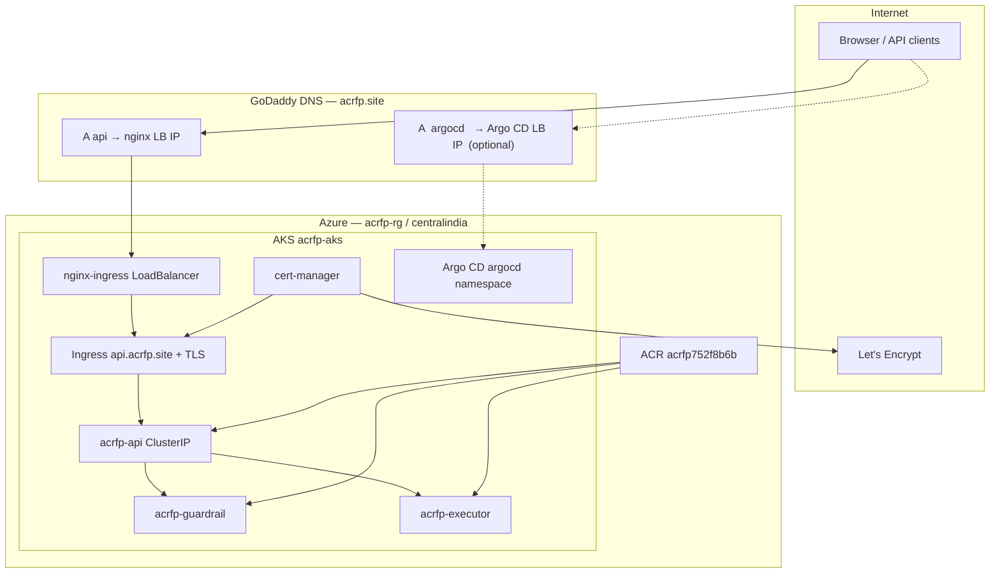

# ACRFP Architecture

Portfolio reference for interviews, LinkedIn, and the demo video intro.

## Full platform


**Flow:** cloud/K8s signals → API → LangGraph orchestrator (Diagnosis / Cost / Remediation) → **Guardrail** (allow / require approval / deny) → Executor (dry-run now, live later) or human queue (`/ui`).

**Interview points:**
1. Agents never call `kubectl` / ARM directly.
2. Guardrail risk comes from **action type + parameters**, not LLM self-rating.
3. Executor never runs without allow or human approval.

## Frontend vs backend


| Layer | What it is | How you reach it |
|-------|------------|------------------|
| Frontend | Approval UI (`GET /ui`) | Browser |
| Backend | FastAPI + agents + guardrail + executor | `/v1/*`, Swagger `/docs` |

Same APIs power Swagger and `/ui`.

## Azure Week 3 layout

```text
Terraform (modules)                 App deploy script
───────────────────                 ─────────────────
module.rg  → acrfp-rg               az acr build → image in ACR
module.aks → acrfp-aks (1 node)  →  kubectl apply → api + guardrail + executor
```

| Path | Role |
|------|------|
| `infra/terraform/main.tf` | Calls modules + outputs |
| `infra/terraform/modules/rg` | Resource group |
| `infra/terraform/modules/aks` | AKS cluster |
| `infra/k8s/` | App Deployments / Services |
| `scripts/week3_aks_deploy.ps1` | ACR build + kubectl apply |

## Production ingress (DNS + TLS + Argo CD)

**Domain:** `acrfp.site` (GoDaddy)  
**App URL:** `https://api.acrfp.site`  
**Argo CD (optional):** `https://argocd.acrfp.site`



| Component | Namespace | Public? | Role |
|-----------|-----------|---------|------|
| nginx-ingress | `ingress-nginx` | Yes (LoadBalancer IP) | HTTPS entry, routes to app |
| cert-manager | `cert-manager` | No | Issues TLS certs via Let's Encrypt |
| acrfp-api | `default` | No (ClusterIP) | FastAPI + agents + `/ui` |
| acrfp-guardrail | `default` | No | Policy allow / deny / approve |
| acrfp-executor | `default` | No | Dry-run actions |
| Argo CD | `argocd` | Optional LB | GitOps deploy from Helm chart |

**Traffic path:** `https://api.acrfp.site` → nginx → Ingress (TLS) → `acrfp-api:80` → guardrail / executor (internal only).

| Path | Role |
|------|------|
| `scripts/install_aks_platform.ps1` | Helm + nginx + cert-manager + Argo CD |
| `infra/platform/cluster-issuer.yaml` | Let's Encrypt staging + prod |
| `infra/helm/acrfp/` | Helm chart |
| `infra/helm/acrfp/values-ingress.yaml` | Ingress enabled for `api.acrfp.site` |
| `infra/k8s/ingress/api-ingress.yaml` | Raw Ingress (alternative to Helm) |
| `infra/argocd/acrfp-application.yaml` | Argo CD app (needs Git repo URL) |

## Image files

| Image | Path |
|-------|------|
| Full platform | `docs/images/acrfp-architecture.png` |
| Frontend vs Backend | `docs/images/acrfp-frontend-backend.png` |
