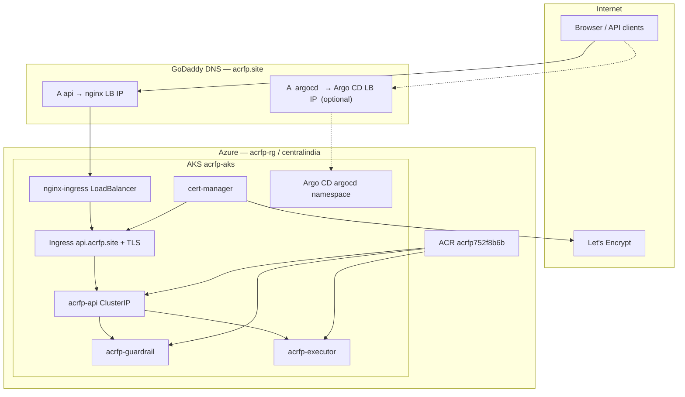

# ACRFP Architecture

Portfolio reference for interviews, LinkedIn, and the demo video intro.

## Full platform


**Flow:** cloud/K8s signals → API → LangGraph orchestrator (Diagnosis / Cost / Remediation) → **Guardrail** (allow / require approval / deny) → Executor (dry-run now, live later) or human queue (`/ui`).

**Interview points:**
1. Agents never call `kubectl` / ARM directly.
2. Guardrail risk comes from **action type + parameters**, not LLM self-rating.
3. Executor never runs without allow or human approval.

## Frontend vs backend


| Layer | What it is | How you reach it |
|-------|------------|------------------|
| Frontend | Approval UI (`GET /ui`) | Browser |
| Backend | FastAPI + agents + guardrail + executor | `/v1/*`, Swagger `/docs` |

Same APIs power Swagger and `/ui`. `/ui` also calls `GET /v1/summary` and `GET /v1/incidents?status=`.

Shareable copy for SharePoint: [`sharepoint/ACRFP-end-to-end-call-flow.md`](sharepoint/ACRFP-end-to-end-call-flow.md).

## End-to-end file call (from user input)

Start: `POST /v1/incidents/ingest` (Swagger, curl, or `scripts/ingest_samples.py`).

| Step | File | Function | Calls `llm.py`? |
|------|------|----------|-----------------|
| 1 | `src/api/app.py` | `ingest()` | No |
| 2 | `src/orchestrator/graph.py` | `run_incident()` → `graph.invoke()` | No |
| 3 | `graph.py` | `triage_node()` | No — `event_type` only |
| 4 | `src/agents/diagnosis.py` | `diagnose()` | **Yes** — `chat_json()` if routed |
| 5 | `src/agents/cost.py` | `analyze_cost()` | **Yes** — only if cost/mixed |
| 6 | `src/agents/remediation.py` | `propose_actions()` | Always calls `chat_json()`; mock/fail → rules |
| 7 | `src/guardrail/policy.py` | `decide()` | **Never** |
| 8 | `src/executor/app.py` | `execute()` | **Never** — only if ALLOW |
| 9 | `src/api/app.py` | `_case_from_graph()` + audit | No |

`chat_json()` lives only in `src/agents/llm.py`. `mock` returns `None` and the specialist uses rules. Guardrail and executor never import LangChain.

Human approve (`POST /v1/approvals/{id}/decide`) skips the graph and sends one parked proposal to the executor.

## Azure Week 3 layout

```text
Terraform (modules)                 App deploy script
───────────────────                 ─────────────────
module.rg  → acrfp-rg               az acr build → image in ACR
module.aks → acrfp-aks (1 node)  →  kubectl apply → api + guardrail + executor
```

| Path | Role |
|------|------|
| `infra/terraform/main.tf` | Calls modules + outputs |
| `infra/terraform/modules/rg` | Resource group |
| `infra/terraform/modules/aks` | AKS cluster |
| `infra/k8s/` | App Deployments / Services |
| `scripts/week3_aks_deploy.ps1` | ACR build + kubectl apply |

## Production ingress (DNS + TLS + Argo CD)

**Domain:** `acrfp.site` (GoDaddy)  
**App URL:** `https://api.acrfp.site`  
**Argo CD (optional):** `https://argocd.acrfp.site`


```mermaid
flowchart TB
  subgraph Internet
    User[Browser / API clients]
    LE[Let's Encrypt]
  end

  subgraph GoDaddy["GoDaddy DNS — acrfp.site"]
    A1["A  api      → nginx LB IP"]
    A2["A  argocd   → Argo CD LB IP  (optional)"]
  end

  subgraph Azure["Azure — acrfp-rg / centralindia"]
    subgraph AKS["AKS acrfp-aks"]
      NGINX[nginx-ingress LoadBalancer]
      CM[cert-manager]
      ING[Ingress api.acrfp.site + TLS]
      API[acrfp-api ClusterIP]
      GR[acrfp-guardrail]
      EX[acrfp-executor]
      ARGO[Argo CD argocd namespace]
    end
    ACR[ACR acrfp752f8b6b]
  end

  User --> A1
  A1 --> NGINX
  NGINX --> ING
  ING --> API
  API --> GR
  API --> EX
  CM --> LE
  CM --> ING
  ACR --> API
  ACR --> GR
  ACR --> EX
  User -.-> A2
  A2 -.-> ARGO
```

| Component | Namespace | Public? | Role |
|-----------|-----------|---------|------|
| nginx-ingress | `ingress-nginx` | Yes (LoadBalancer IP) | HTTPS entry, routes to app |
| cert-manager | `cert-manager` | No | Issues TLS certs via Let's Encrypt |
| acrfp-api | `default` | No (ClusterIP) | FastAPI + agents + `/ui` |
| acrfp-guardrail | `default` | No | Policy allow / deny / approve |
| acrfp-executor | `default` | No | Dry-run actions |
| Argo CD | `argocd` | Optional LB | GitOps deploy from Helm chart |

**Traffic path:** `https://api.acrfp.site` → nginx → Ingress (TLS) → `acrfp-api:80` → guardrail / executor (internal only).

## Azure AI Foundry (model only)

Foundry hosts the **LLM**. ACRFP (on AKS or laptop) stays the control plane.

```
Foundry model deployment (Claude/GPT in-region)
        ↑ chat via /openai/v1
acrfp-api  (LLM_PROVIDER=azure_foundry → src/agents/llm.py)
        → acrfp-guardrail / acrfp-executor   (no Foundry keys)
```

Wire steps and env vars: root [`README.md`](../README.md) (*Azure AI Foundry*) and [`project-journey-runbook.md`](project-journey-runbook.md) Phase 3. Do not use Foundry Agent Service as the orchestrator.

| Path | Role |
|------|------|
| `scripts/install_aks_platform.ps1` | Helm + nginx + cert-manager + Argo CD |
| `infra/platform/cluster-issuer.yaml` | Let's Encrypt staging + prod |
| `infra/helm/acrfp/` | Helm chart |
| `infra/helm/acrfp/values-ingress.yaml` | Ingress enabled for `api.acrfp.site` |
| `infra/k8s/ingress/api-ingress.yaml` | Raw Ingress (alternative to Helm) |
| `infra/argocd/acrfp-application.yaml` | Argo CD app (needs Git repo URL) |

## Image files

| Image | Path |
|-------|------|
| Full platform | `docs/images/acrfp-architecture.png` |
| Frontend vs Backend | `docs/images/acrfp-frontend-backend.png` |
